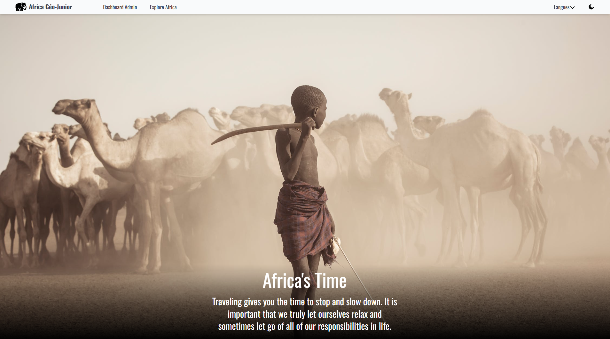

# Brief 7 | Africa Géo-Junior

### Contexte de Projet
L'objectif de ce projet est de concevoir une application web éducative pour enrichir les connaissances géographiques des élèves sur le continent africain. Le projet se concentre sur l’interaction avec une base de données bien structurée, comprenant les entités Continent, Pays, et Ville, tout en respectant les principes fondamentaux de SQL et des SGBD.

### Fonctionnalités Principale

- **Affichage de Pays et de Villes :**
    - Présentation interactive des pays et des villes sous forme des cartes et des tableaux dynamiques.
    - Affichage des détails comme la capitale, la population, le type, et les langues officielles.
-  **Dashboard administrateur :**
    - Tableau de bord structuré et ergonomique pour une gestion efficace.
- **Gestion CRUD (Create, Read, Update, Delete) :**
    - Création de nouvelles données (ajout de continents, pays, villes et informations associées).
    - Modification des informations existantes.
    - Suppression sécurisée des données.
- **Base de données relationnelle (SQL) :**
    - Interaction avec une base de données bien structurée (tables pour Continent, Pays, Ville avec relations claires).
    - Respect des normes ACID pour garantir l’intégrité des données.
- **Interface utilisateur fluide et responsive :**
    - Interface adaptée à tous les écrans (desktop, tablette, mobile).

### Technologies et Outils utilisées
- HTML
- Framwork TailwindCSS
- JavaScript
- PHP
- MySQL
- Git et GitHub Project pour la planification